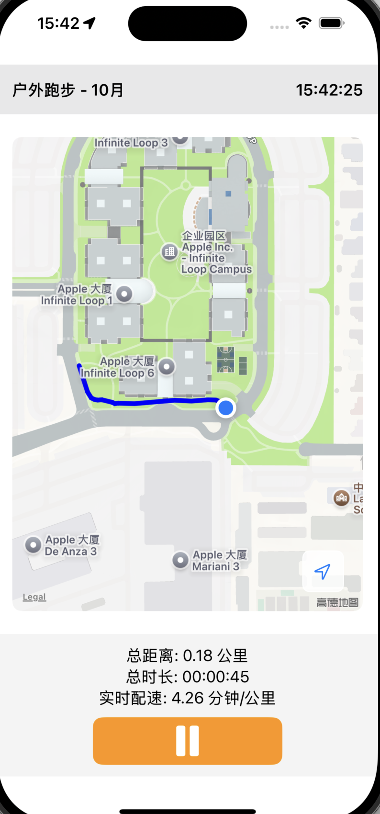
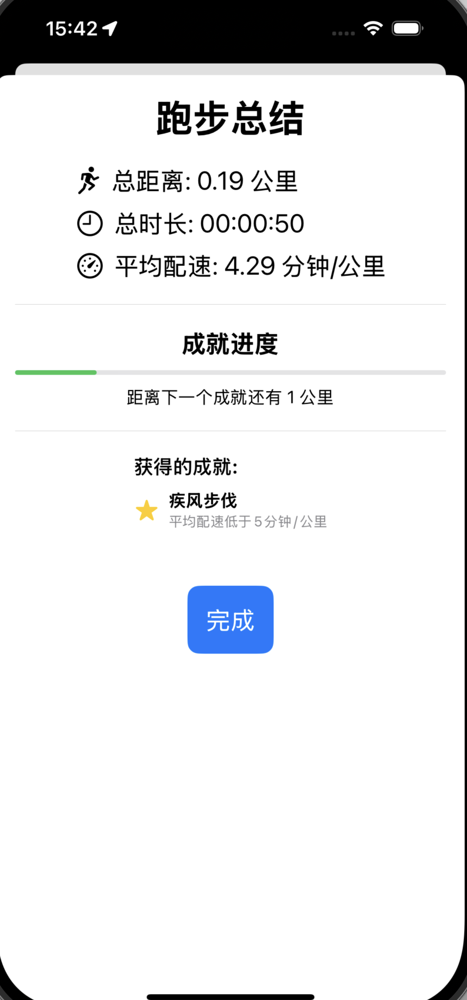

# iRunner

[项目地址](https://github.com/Vegetog/iRunner)

## 项目概述

iRunner 是一个 iOS 应用程序，旨在帮助用户跟踪他们的跑步活动。该应用利用 GPS 技术记录用户的跑步路线，提供详细的统计数据和可视化信息，并包含一个激励性的成就系统。

## 示例画面

    
    

## 演示视频

[点击此处查看演示视频](https://www.bilibili.com/video/BV1gSxQeQE79)

## 功能特性

- 实时 GPS 跟踪
- 路线可视化
- 跑步统计（距离、时间、配速等）
- 成就系统
- 实时跑步数据展示

## 技术栈

- Swift 6
- SwiftUI
- MapKit
- Core Location

## tips

开发初期，遇到一个问题，在Xcode模拟器端路线正常，但是在本机上路线存在偏移问题

经查证是由于坐标系统的差异造成的。中国大陆地区使用的是GCJ-02坐标系（也称为火星坐标系），而GPS设备通常使用的是WGS-84坐标系。这种差异可能导致观察到的偏移。

因此本代码添加了坐标系统转换的部分，将WGS-84坐标系转换为GCJ-02坐标系，经实机测试在中国大陆轨迹绘制正确。

## 安装指南

1. 克隆仓库：git clone https://github.com/Vegetog/iRunner.git
2. 打开 Xcode 项目文件 `iRunner.xcodeproj`
3. 在 Xcode 中选择目标设备或模拟器
4. 点击运行按钮或按 `Cmd + R` 来构建和运行项目

## 使用说明

1. 启动应用
2. 允许位置访问权限
3. 点击 "开始跑步" 按钮开始记录
4. 跑步过程中，实时查看跑步数据
5. 跑步结束后点击 "结束" 按钮
6. 查看跑步统计和本次成就获得情况

## 贡献指南

我们欢迎任何形式的贡献。如果您想为项目做出贡献，请遵循以下步骤：

1. Fork 项目
2. 创建您的特性分支 (`git checkout -b feature/AmazingFeature`)
3. 提交您的更改 (`git commit -m 'Add some AmazingFeature'`)
4. 推送到分支 (`git push origin feature/AmazingFeature`)
5. 开启一个 Pull Request

## 版权和使用声明

版权所有 (c) 2024 Vegetog

本项目受版权法保护，并附带以下使用限制：

1. 本项目及其所有代码仅供学习和参考目的使用。
2. 禁止将本项目或其中的任何部分用于商业目的。
3. 禁止将本项目或其代码用作学术作业或任何形式的作业提交。
4. 未经作者明确书面许可，不得修改、分发或以任何形式使用本项目进行二次开发。
5. 在使用本项目代码进行学习或参考时，请注明来源。

使用、复制或查看本项目即表示您同意遵守上述所有条款。
违反这些条款可能导致法律后果。详细信息请查看 [LICENSE.md](LICENSE.md) 文件。

